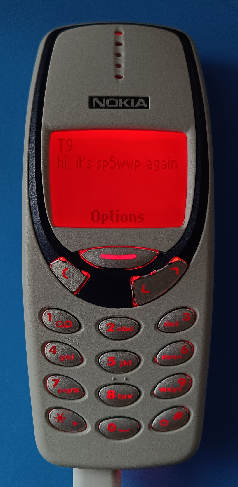

# M17_3310-fw

Example firmware for the [Nokia 3310 M17 board](https://github.com/M17-Project/M17_3310).
Together with the hardware, this experimental firmware allows sending text messages
from the classic Nokia 3310 over the M17 network.
> [!NOTE]
> Packet reception is still work in progress.

## How to compile

Clone this repository with all its submodules:

```
git clone --recurse-submodules https://github.com/M17-Project/M17_3310-fw.git
```

To compile this firmware, you need to download and install the STM32CubeIDE first.
You can find the installer package [here](https://www.st.com/en/development-tools/stm32cubeide.html#get-software).
STM32CubeIDE is available for Linux, Windows, and macOS.

Start STM32CubeIDE, click on "File" > "Open Projects from File System..." and select the cloned directory.

Inside STM32CubeIDE:
  * right click on the topmost item (M17_3310-fw)
  * select "Properties"
  * under "C/C++ Build" select "Settings"
  * click on "MCU/MPU GCC Compiler" > "Include Paths"
  * make sure that the following paths are included:

```
../Core/Inc
../Core/libm17
../Drivers/STM32F4xx_HAL_Driver/Inc
../Drivers/STM32F4xx_HAL_Driver/Inc/Legacy
../Drivers/CMSIS/Device/ST/STM32F4xx/Include
../Drivers/CMSIS/Include
../USB_DEVICE/App
../USB_DEVICE/Target
../Middlewares/ST/STM32_USB_Device_Library/Core/Inc
../Middlewares/ST/STM32_USB_Device_Library/Class/CDC/Inc
```
These include paths are required because the project uses STM32 HAL, USB CDC, and the libm17 submodule.
Using the directory tree to the left, navigate to `Core/t9/tests`, then right-click on `test.c` and select "Resource configurations" > "Exclude from build" (tick everything).
Finally, right-click again the topmost item (M17_3310-fw), then select "Build Configurations" > "Set active" and decide between "Debug" and "Release".

Now you can build everything with "Build Project".

## T9 support
T9 text entry support is provided via our own standalone [library](https://github.com/M17-Project/M17_T9/tree/dev).


